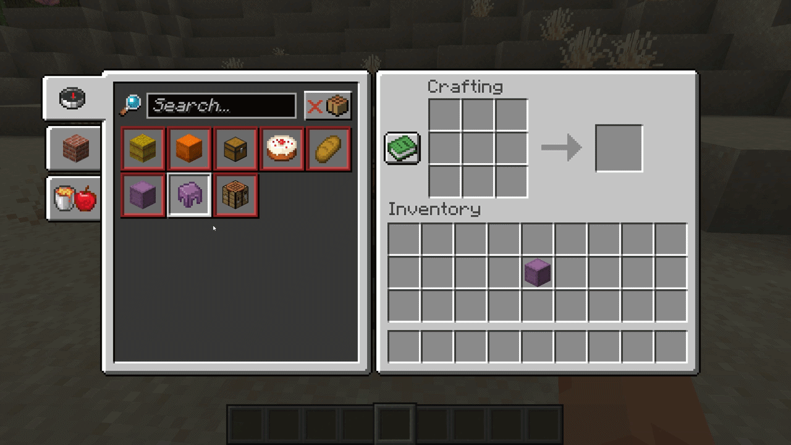

# Shulker Box Uncrafting


[](https://github.com/brandonhenness/shulker-box-uncrafting/actions/workflows/validate.yml)
[](LICENSE)

**Turn an empty shulker box back into the chest and two shells used to craft it.**



Shulker Box Uncrafting adds one shapeless recipe. Put an empty shulker box in either a 2x2 player crafting grid or a crafting table to receive two shulker shells. The chest returns to the input slot, just like a bucket left behind by a cake recipe.

## Recipe

| Input | Crafted result | Returned item |
| --- | --- | --- |
| 1 empty shulker box | 2 shulker shells | 1 chest |

- The undyed box and all 16 dyed variants work.
- The box must be completely empty.
- A box from a custom map, command, or mod may create its contents the first time it is opened. Open it and remove anything inside before trying the recipe.
- Renamed boxes and boxes with other custom data are accepted, but that extra data is not kept after uncrafting.
- Dye is not returned. The recipe gives back only the chest and two shells used to make a shulker box.
- When a Crafter uses the recipe, the chest and shells both come out through the Crafter's front.

## Requirements

The server needs the following:

| Dependency | Version |
| --- | --- |
| Minecraft | `26.2` |
| Fabric Loader | `0.19.3` or a compatible newer version |
| [Fabric API](https://modrinth.com/mod/fabric-api) | `0.158.0+26.2` or newer for Minecraft 26.2 |
| [Recipe Remainders](https://modrinth.com/mod/recipe-remainders) | `0.1.0` or a compatible newer version |

Recipe Remainders and Fabric API are required on the server. This datapack does not work on a vanilla server.

Vanilla Minecraft 26.2 clients can connect to a server using this datapack. Players do not need to install Fabric Loader, Fabric API, or Recipe Remainders on their clients.

Installing Fabric API and Recipe Remainders on a Fabric client is optional. Doing so makes the returned chest appear immediately and lets the recipe book tell empty and filled shulker boxes apart. For singleplayer, install both mods in the client because the integrated server loads the recipe.

## Installation

1. Install Fabric Loader, Fabric API, and Recipe Remainders on the server. For singleplayer, install them in the Minecraft instance you will use.
2. Download the datapack ZIP from [Modrinth](https://modrinth.com/datapack/shulker-box-uncrafting) or the [GitHub Releases page](https://github.com/brandonhenness/shulker-box-uncrafting/releases).
3. Put the ZIP in the world's `datapacks` folder. Do not extract it.
4. Restart the server, or run `/reload` after adding the pack to an existing world.
5. Check that Minecraft lists it as enabled:

   ```mcfunction
   /datapack list enabled
   ```

Use the attached `shulker-box-uncrafting-<version>+mc26.2.zip` release file on GitHub. Do not download GitHub's automatically generated **Source code** ZIP; that archive has an extra folder around the datapack and Minecraft will not load it directly.

The recipe unlocks when a player obtains any shulker-box variant. You can grant it manually while testing:

```mcfunction
/recipe give @s shulker_box_uncrafting:empty_shulker_box_to_shells
```

## Recipe-book behavior

The server moves only a valid empty shulker box into the crafting grid when recipe-book autofill is used. Filled boxes remain untouched.

A vanilla client may still highlight the recipe while the player has only a filled box because it does not receive every component check used by the server. Clicking the recipe is safe: the server refuses the filled box. Installing Fabric API and Recipe Remainders on the client corrects the highlight and removes the brief delay before the chest appears.

## If Recipe Remainders is missing

On a Fabric server with Fabric API but without Recipe Remainders, the recipe and its recipe-book unlock are skipped. The datapack will not add a broken recipe that consumes a box without returning its chest.

Players joining a server without Recipe Remainders receive a one-time warning from the server. Players do not need the mod on their clients; the warning checks whether the server has the mod installed.

A vanilla server cannot read the Fabric ingredient used by this pack. Remove or disable the pack before moving the world to a vanilla server.

## Troubleshooting

- **The pack is missing from `/datapack list`:** make sure you downloaded the attached release ZIP, not GitHub's Source code ZIP. If you extracted it, `pack.mcmeta` must be directly inside the datapack folder.
- **The recipe is missing:** confirm that the server has Fabric API and Recipe Remainders, run `/reload`, and then try the `/recipe give` command above.
- **Minecraft reports an unknown `fabric:type`:** Fabric API or Recipe Remainders is missing or incompatible with the installed Minecraft version.
- **A shulker box will not uncraft:** remove every item from it. If it came from a map, command, or mod, place and open it once, remove anything that appears, and pick it back up.
- **The chest briefly disappears on a client:** this is a display delay only. Install Fabric API and Recipe Remainders on that client for immediate display.

## Building from source

PowerShell 5.1 or newer is the only local build requirement. On Windows, run this from the repository root:

```powershell
powershell.exe -NoProfile -ExecutionPolicy Bypass -File .\scripts\build.ps1 -OutputDirectory dist
```

On Linux or macOS with PowerShell 7, use `pwsh -File ./scripts/build.ps1 -OutputDirectory dist`.

The script checks the metadata, recipe, advancement, and pack icon before creating the installable ZIP and `SHA256SUMS` in `dist`.

## Project links

- [Download on Modrinth](https://modrinth.com/datapack/shulker-box-uncrafting)
- [Source code and releases](https://github.com/brandonhenness/shulker-box-uncrafting)
- [Report a problem](https://github.com/brandonhenness/shulker-box-uncrafting/issues)
- [Recipe Remainders](https://github.com/brandonhenness/recipe-remainders)

## License

Shulker Box Uncrafting is licensed under [GPL-3.0-only](LICENSE).
